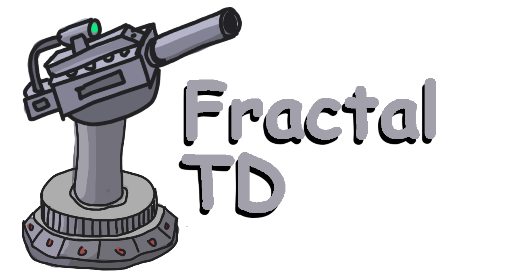

  

  <strong>🏰 SFU Game Dev Club 🏰</strong> 
  <a href="https://drive.google.com/drive/folders/1OUQbcvAvJj1m683AtLJk0Az_zv_PoBC_?usp=sharing" target="_blaank">Demo</a>

---
## Introduction
Fractal TD is a fast paced tower defence game made for the 2021 BC Game Jam. The theme for this game jam was "Infinity". When we heard this, we immediately went to fractals, which are infinite patterns. This idea of fractals are what defines the path you are required to protect. Just like fractals, the path is never ending. Because of this, the game camera is exponentially zooming out to reveal more and more of the path. As the camera zooms out however, the enemies get larger and larger until you reach a point where your once great towers are puny in comparison.

## Tech Stack
- Godot for game development
- GIMP for graphics editing 
- Audacity for audio editing

## Final notes
Since a majority of our group members weren't familiar with Godot, this was a huge opportunity to explore the tool for us. As a result however, there's jank... and a lot of it. Regardless, we had fun throughout the process and look forward to flexing our improved Godot skills in whatever game we tackle next.

## Running our game
You can run the game on Godot through this repo or download the executable directly <a href="https://drive.google.com/drive/folders/1OUQbcvAvJj1m683AtLJk0Az_zv_PoBC_?usp=sharing" target="_blaank">here</a>. Good luck :)

  

